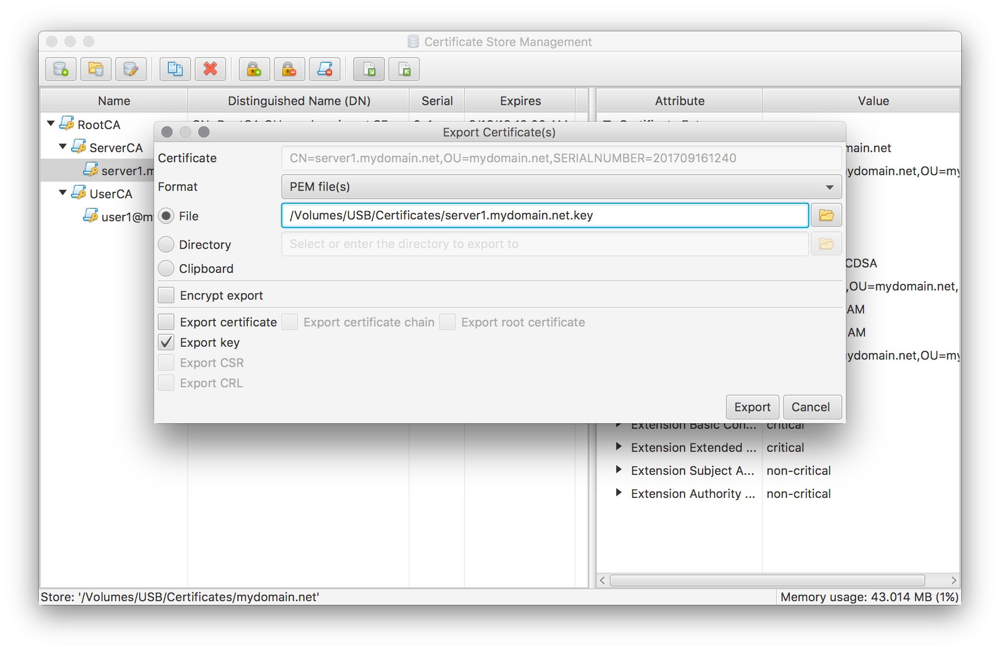
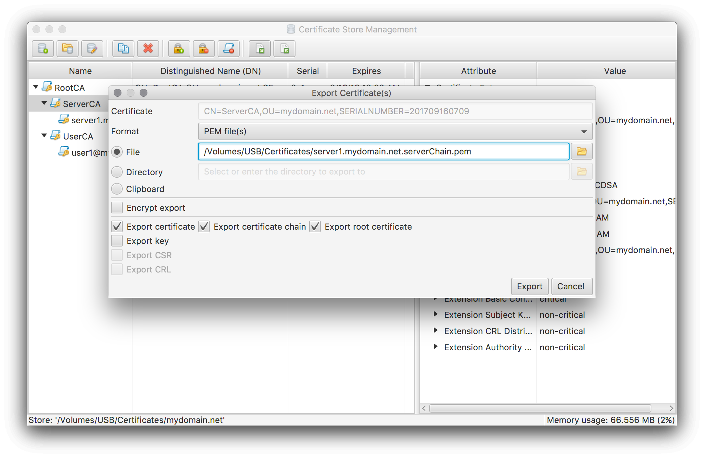
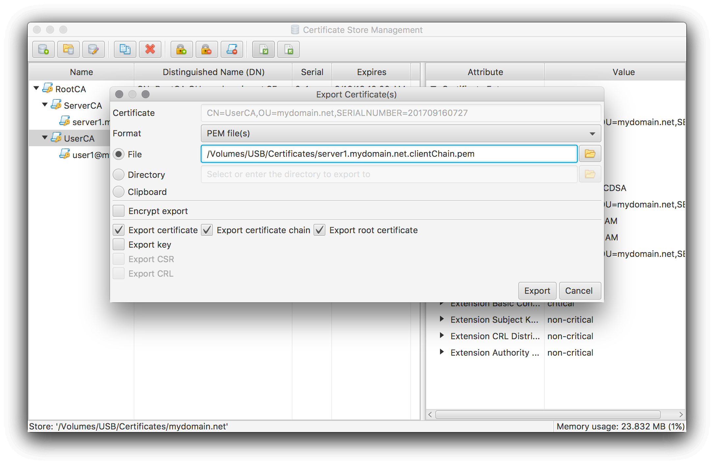
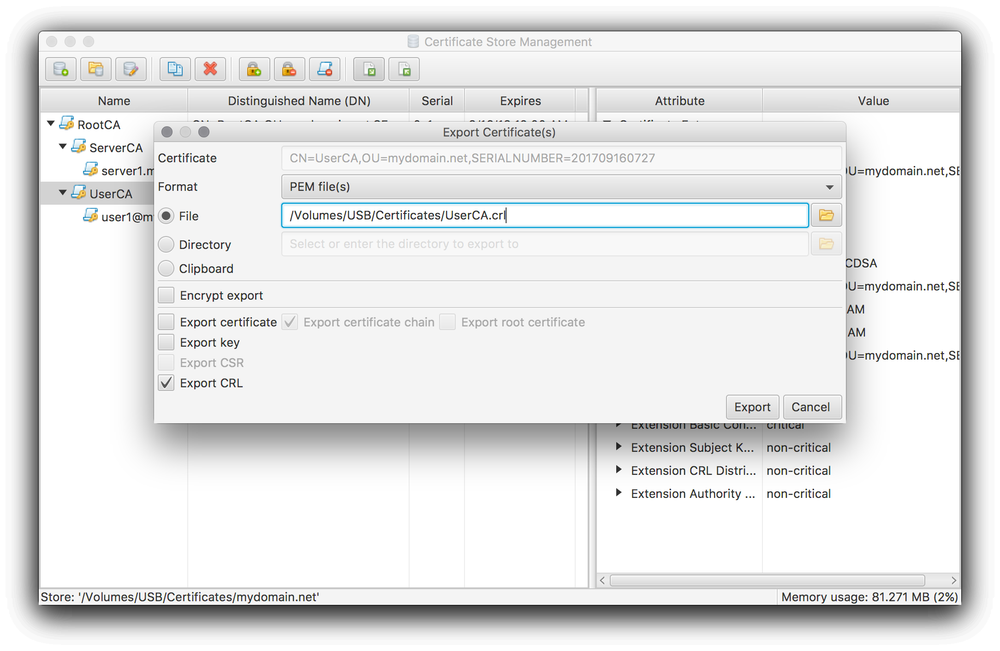
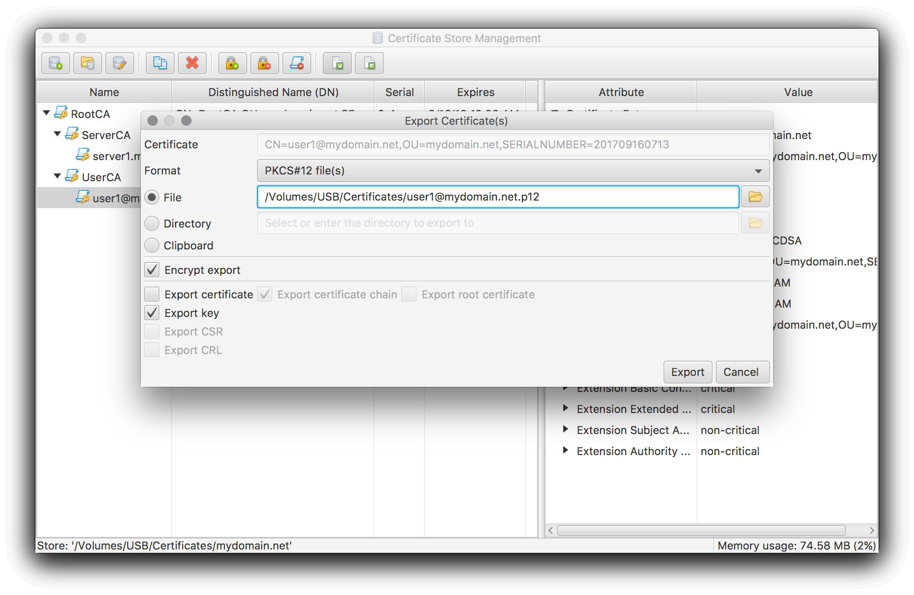

### Configure Apache to use your certificates
This HowTo assumes that you either have created your own private CA (see [Create your own private CA](../howtoLocalCa/)) or have created certificates signed by an external CA (see [Create and manage certificates of an external CA](../howtoExternalCA)).

#### Installing server certificate
After following one of the HowTos above you now have have a server certificate in your certificate store.
In order to use this certificate for your Apache server the following SSL Module config parameters need to be set:
```
## Server Certificate:
# Point SSLCertificateFile at a PEM encoded certificate. If the certificate
# is encrypted, then you will be prompted for a pass phrase. Note that a
# kill -HUP will prompt again. Keep in mind that if you have both an RSA
# and a DSA certificate you can configure both in parallel (to also allow
# the use of DSA ciphers, etc.)
SSLCertificateFile <path to pem encoded certificate file>

## Server Private Key:
# If the key is not combined with the certificate, use this directive to
# point at the key file. Keep in mind that if you've both a RSA and a DSA
# private key you can configure both in parallel (to also allow the use of
# DSA ciphers, etc.)
SSLCertificateKeyFile <path to pem encoded key file>

## Server Certificate Chain:
# Point SSLCertificateChainFile at a file containing the concatenation of
# PEM encoded CA certificates which form the certificate chain for the
# server certificate. Alternatively the referenced file can be the same as
# SSLCertificateFile when the CA certificates are directly appended to the
# server certificate for convinience.
SSLCertificateChainFile <path to pem encoded server chain file>
```
To create the `SSLCertificateFile` file perform an export on the server certificate with the following settings:


To create the `SSLCertificateKeyFile` file perform an export on the server certificate with the following settings:



**Take special care of this file** as it is now no longer encrypted. It has to copied to it's target location in a secure manner (e.g. via ssh) and has to be protected by restrictive access rights (e.g. via chmod 0600). You may choose to encrypt the exported file. But as a result Apache will ask for the password on every restart/reload.

To create the `SSLCertificateChainFile` file perform an export on the **server certificate's issuer** certificate with the following settings:



If you have an official root certificate (e.g. because you use an external CA) I suggest to omit the root certificate export.

Now copy the created files to your server and adapt the Apache config parameters listed above according to your environment. After a restart the Apache server should now use the new certificate.

For a first test point your browser at your server and check the security information.

If your server is available on the internet I strongly advice to verify your setup by running Qualys SSL Server Test [https://www.ssllabs.com/ssltest/](https://www.ssllabs.com/ssltest/) against your server.

#### Enabling client authentication
If you want to use client certificates to restrict access to your Apache server the following SSL Module config parameters need to be set also:
```
## Certificate Authority (CA):
# Set the CA certificate verification path where to find CA certificates
# for client authentication or alternatively one huge file containing all                               
# of them (file must be PEM encoded).
# Note: Inside SSLCACertificatePath you need hash symlinks to point to the
# certificate files. Use the provided Makefile to update the hash symlinks
# after changes.
#SSLCACertificatePath /etc/ssl/apache2/ssl.crt
SSLCACertificateFile <path to pem encoded client chain file>

## Certificate Revocation Lists (CRL):
# Set the CA revocation path where to find CA CRLs for client authentication
# or alternatively one huge file containing all of them (file must be PEM
# encoded).
# Note: Inside SSLCARevocationPath you need hash symlinks to point to the
# certificate files. Use the provided Makefile to update the hash symlinks
# after changes.
#SSLCARevocationPath /etc/ssl/apache2/ssl.crl
SSLCARevocationFile <path to pem encoded crl file>

## Client Authentication (Type):
# Client certificate verification type and depth. Types are none, optional,
# require and optional_no_ca. Depth is a number which specifies how deeply
# to verify the certificate issuer chain before deciding the certificate is
# not valid.
SSLVerifyClient require
SSLVerifyDepth  2
```
To create the `SSLCACertificateFile` file perform an export on the **user certificate's issuer** certificate with the following settings:



As for the server chain above, if you have an official root certificate (e.g. because you use an external CA) I suggest to omit the root certificate export.

To create the `SSLCARevocationFile` file perform an export on the **user certificate's issuer** certificate with the following settings:



Please note that the CRL export is only possible after you have performed a first update of your CA's CRL (see the initially mentioned CA HowTos for further details).

Settings the parameter `SSLVerifyClient` to `require` enables client certificate verification. The value of `SSLVerifyDepth` defines the maximum allowed length of the issuer chain. The value `2` enables the use of one intermediate certificate.

Now copy the created files to your server and adapt the Apache config parameters listed above according to your environment. After a restart the Apache server should now ask for a client  certificate.

To test the setup you have to import the client certificate into your OS' or browser's certificate store. Both of them will most likely accept a PKCS#12 file created as follows:



Pointing your browser at your server now should bring up some kind of certificate selection dialog listing the imported client certificate as one option.

[<< Index](..)
